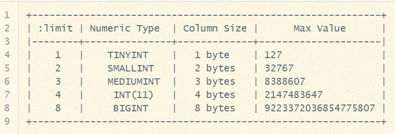

# 记录

### 创建记录

1. 创建 Model
   ```bash
   bin/rails g model record
   等同于
   bin/rails generate model record
   ```

2. 生成 `db/migrate/时间戳_create_records.rb` 数据

   - 添加对应的字段, 例如: `amount` 金额, `notes` 备注

3. 命令
   ```bash
   数据库就会含有对应字段的表
   bin/rails db:migrate
   ```
   - 查看 `schame.rb` 是否 `records` 是否成功执行

4. TDD 测试驱动开发
   - 创建 `spec/request/records_request_spec.rb`
   ```ruby
   require 'rails_helper'

   RSpec.describe "Records", type: :request do
     it "should create a record" do
       # 金额单位为最小单位 分, 防止浮点数不精确
       # 类型: 支出
       post '/records', params: {amount: 10000, category: 'outgoings', notes: '请客'}
       expect {response.status}.to eq 200
       body = JSON.parse(response.body)
       expect(body["resource"]["id"]).to be
     end
   end
   ```
   ```bash
    执行 rspec
   bin/rspec  # 执行所有 rspec
   bin/rspec -e "描述"  # 执行一个
   ```
   错误1: 没有路由
   ```ruby
   # routes.rb
   resources :records
   #  POST   /records(.:format)  records#create
   ```
   错误2: 没有 `/posts`
   - 新建 `controller`
   ```bash
    bin/rails g controller records # 复数   
   ```
   - 创建了 `records_controller.rb`, 自动创建了 `records_request_spec.rb`
   - 之前创建了, 就不用覆盖了
   
   
5. `records_controller.rb` (对应上4)

   ```ruby
    class RecordsController < ApplicationController
      # 创建
      def create
      
      end
    end
    ```
 
 6. 继续测试 `models/record_spec.rb`
```ruby
# amount 不能为空
# model/record.rb
class Record < ApplicationRecord
  validates_presence_of :amount, :category
end 
```

7. 汉化
- `config/locales/zh-CN.yml`

8. `API` 文档  `spec/acceptance/record_spec.rb`
9. 执行
```bash
bin/rake docs:generete
```

10. 查看 `doc/api/名字.html`

11. 让 `category` 变成枚举
```ruby
enum category: { outgoings: 1, income: 2 }
```

12. 创建必须 登录
   - 在需要登录的地方 `must_sign_in`, `records_controller.rb`
   - 在父类定义 `must_sign_in` 方法, 捕获 `CustomError`, `lib/custom_error.rb`
   - 调用 对应的方法





---

### 获取记录
优化1: 公有和私有方法 `before_action` `private`
```ruby
class RecordsController < ApplicationController
  # 所有的 public 方法都是 action
  before_action :must_sign_in

  # 所有的
  def index
    recored = Record.all
  end

  # 下面的都是私有方法
  private
  def  create_params
    params.permit(:amount, :category, :notes)
  end
end
```

优化2: 不获取所有, 使用分页
```ruby
gem 'kaminari'  # 分页插件
```

知识点3: index 获取所有, show 展示一个